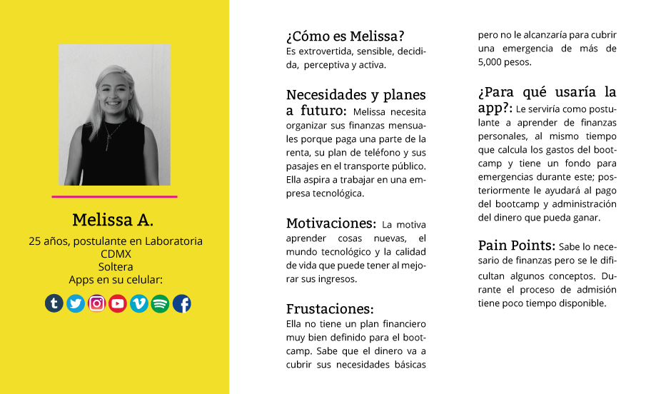
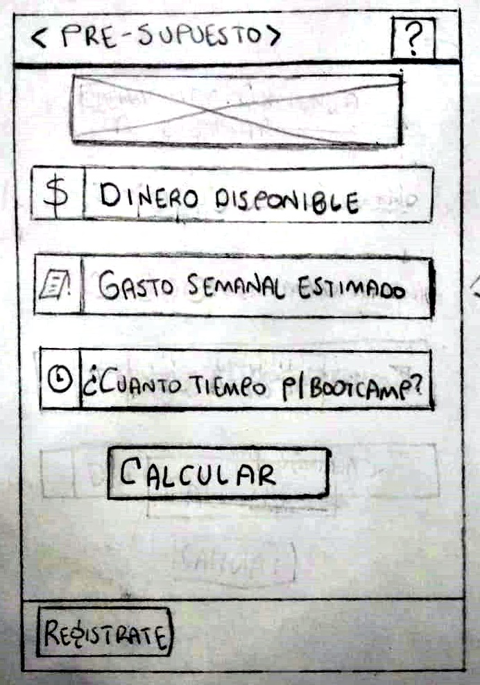
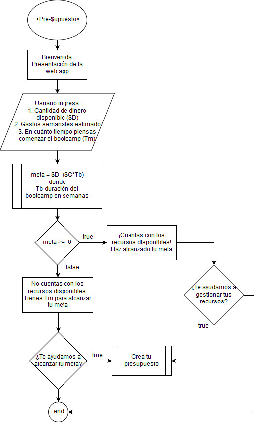

# "Pre-supuesto"

## Problemática

Nuestra aplicación está dirigida a **postulantes de Laboratoria** que quieran saber al momento de su **registro**, con base en sus gastos mensuales y ahorros, si cuentan con los recursos necesarios para cursar el bootcamp, ya que los requisitos son los siguientes:

_"El Bootcamp tiene una duración de 6 meses, es intensivo y deberás venir a clases de Lunes a Viernes durante 5 hrs diarias. Es importante recalcar que esta parte del programa no se puede hacer online y requerirá tiempo completo de dedicación de tu parte, ya que deberás estudiar y hacer tareas en tu casa diariamente"._

Al ser un programa intensivo y de tiempo completo, las postulantes no pueden obtener ingresos por lo que se ven limitadas en situaciones cómo vivir de ahorros o préstamos. 

Esta es la razón por la que nace “Pre-supuesto”, pues es una herramienta para que las futuras postulantes tengan el conocimiento de sus finanzas y puedan saber de manera rápida y sencilla si podrán solventar su permanencia en el Bootcamp, e incluso saber cuánto dinero deben de tener para mantenerse 6 meses sin ingresos.

En el caso de que los ingresos actuales de las postulantes no sean suficientes para su permanencia en el Bootcamp, la aplicación les brindará la posibilidad de calcular el ahorro que necesitarán para poder solventar su permanencia en el Bootcamp.

1. **Usuarixs:** Postulantes de Laboratoria.

2. **Solución:** Fomentar que lxs usuarixs administren sus gastos.

Si la postulante después de ingresar sus datos quiere seguir teniendo la forma de administrar su dinero, lxs usuarixs tendrán que crear una cuenta para poder obtener el seguimiento y registro de su información, así podrá realizar cambios, como gastos imprevistos fuera del presupuesto.

## UX

- ### Historias de usuario

1. Yo como postulante de Laboratoria quiero ingresar a “Pre-supuesto”, para identificar si mi ahorro/ingreso es suficiente para poder cursar el bootcamp.

2. Yo como estudiante de Laboratoria quiero poder realizar un presupuesto de los próximos 6 meses para poder sobrellevar los gastos que realizaré durante el bootcamp.

- ### User persona

   

- ### Diseño visual

Se consideró utilizar la identidad gráfica de Laboratoria, para que el usuarix sienta confianza al momento de ingresar, además de que exista un vinculo con la marca pues se plantea que sea mostrada a las postulantes después de que realicen el pre-trabajo.

Se trato de que el diseño fuera fácil, intuitivo y de rápida accesibilidad, para evitar que la usuaria pudiera perder el interés en la web app.
    
    * Paleta de color (Laboratoria).
    Se utilizaron los principales colores de la identidad gráfica los cuales son el amarillo y el gris, así como los contrastes de color con blanco.
    
    * Tipografía (Laboratoria)
    El uso de la tipografía fue Open Sans, en sus variables Regular, Semibold, Bold.

    * Creación de logotipo
    El diseño se creo pensando en una variable del diseño de laboratoria, pues el usuarix ya ha visto de manera anticipada el logotipo de Laboratoria, por lo que podrían hacer tener confianza en usar la aplicación. Para el icono que se utiliza en algunas de las pantallas se abrevió la palabra Pre-supuesto, usando P$, haciendo una analogía al dinero.

- ### Investigar la competencia (Benchmark)
    Fintonic (Aplicación móvil)

    Esta aplicación es móvil, sin embargo en el mercado son muy escasas las aplicaciones web sobre finanzas personales. Fintonic es una aplicación compleja sin embargo es muy gráfica y fácil de usar, pues cuenta con instructivo, además te deja utilizarla con un presupuesto generado por ellos para que puedas ver los alcances de la aplicación. Entre las funcionalidades de la aplicación se encuentran: inicio de sesión, envio de mensajes SMS sobre tus gastos, vinculación de tus cuentas bancarias y tu número del móvil, lista de gastos con la opción de añadir categorias, generación de gráficas, permite ver la opción de nuestras finanzas por semana, mes, etc.

- ### Modelo de negocio.

   

- ### Sketch y/o prototipo (alta fidelidad , baja fidelidad o navegable.)

    1. Sketch (baja fidelidad)

    

    2. Prototipo 1.0 Figma. 
    
    [Demo](https://www.figma.com/proto/bLrKYSYOSwNRFz4bEJs25h/Pre-supuesto?node-id=10%3A95&scaling=scale-down)
    
    

- ### Qué hizo cada una en el proyecto.
    * Isis Lázaro
        - Diagrama de flujo, Interactividad (Javascript)
    * Julieta Cervantes
        - UX (User persona, modelo de negocios, investigación)
    * Leticia Vianey Lara Rangel
        - Estructura readme, sketch, maquetado (Html, Css)
    * Maricruz Carmona
        - Prototipo Alta, Diseño UI, análisis de competencia
    
- ### Documentación de la importancia de una gestion saludable de la finanzas.

# FE

- ## Diseño de UI
    
    ### Diagrama de flujo

    

    ### MVP(Código)
    
    * Lista de gastos mensuales
    * Ahorro disponible
    * Tiempo sin percibir ingresos

    ### Definition of done (del prototipo)
    
    1. Mostrar al usuarix si podrá solventar su permanencia en el bootcamp.

    2. Informar al usuarix sobre cómo, cuándo y que rubros debe utilizar para generar el hábito del ahorro y la gestión de finanzas personales y así establecer una meta realista y alcanzable a corto/mediano plazo.

    ### Software utilizado

    1. Figma
    2. Draw.io
    3. Librerias Boostrap y SweetAlert2
    4. Html
    5. Javascript
    6. Css
    7. Trello
